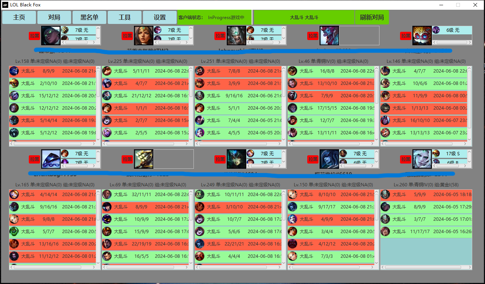

LOL战绩查询助手

准备：创建数据库，运行lol_box.sql
现在台服也要管理员命令才能获取port和token了，因此开发工具需要管理员权限才能在开发时获取token和port。

运行：开发完毕如果直接运行jar包，需要将jar包放在RunAsAdmin.vbs同级目录下，然后修改其中的lol_black_box.jar为你们自己的jar包名；然后双击RunAsAdmin.vbs就可以启动。

